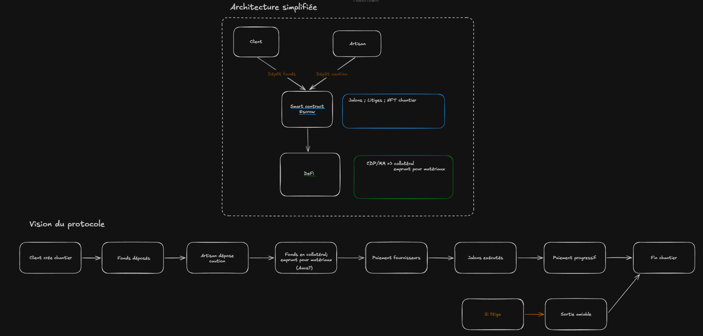

# Trust BTP


[](https://opensource.org/license/MIT)
[](https://sepolia.arbiscan.io)
[]()

---

## À propos du projet

Ce projet a été développé dans le cadre d'une certification Web3.

Trust BTP est une plateforme Web3 qui sécurise les paiements de travaux via un escrow smart contract à jalons, génère du yield DeFi sur les fonds en attente, et construit la réputation on-chain de chaque artisan via un Trust Score automatique.

> Note : cette version (Beta/Testnet) est restreinte à Arbitrum Sepolia. L'architecture est conçue pour évoluer vers d'autres protocoles DeFi.

---

## Concepts clés

| Terme | Définition |
|---|---|
| **Séquestre (Escrow)** | Mécanisme de blocage des fonds par un tiers neutre (le smart contract) jusqu'à validation d'une condition. |
| **Jalon** | Étape définie à l'avance dans le devis. Les fonds correspondants sont libérés uniquement à la validation. |
| **Devis** | Proposition contractuelle soumise par l'artisan : jalons, montants, délais. Signé on-chain par le particulier. |
| **Yield opt-in** | Option permettant aux fonds bloqués de générer des intérêts sur Aave V3 pendant la durée du chantier. |
| **NFT Soulbound** | Token non-transférable lié à un chantier, mis à jour à chaque étape. Sert de preuve d'exécution. |
| **Trust Score** | Score de réputation (0–100) calculé on-chain pour chaque artisan selon l'historique de ses chantiers. |
| **Litige** | Procédure déclenchée en cas de désaccord. Un arbitre tiers résout le différend et décide de la répartition des fonds. |
| **USDC** | Stablecoin dollar (Circle) utilisé comme unique monnaie de paiement sur le protocole. |

---

## Architecture du Protocole

Le projet illustre les concepts avancés du Web3 :

- **Architecture modulaire** — séparation entre le coffre (`EscrowVault`) et les composants optionnels (`YieldProvider`, `TrustScoreRegistry`, `ChantierNFT`) pour une évolutivité sans migration de fonds.
- **Standards ERC** — ERC-20 (USDC), ERC-721 Soulbound (NFT chantier), ERC-4626 (intégration Aave V3).
- **Gestion des rôles** — séparation des permissions entre Artisan, Particulier, Arbitre et Owner (multisig) via un système de contrôle d'accès on-chain.
- **Traçabilité on-chain** — chaque action émet un événement indexable pour alimenter le frontend en temps réel.



## Structure du Monorepo

Le projet est divisé en deux entités distinctes :

```
surepay/
├── backend/                  # Smart contracts Solidity + tests Hardhat
│   ├── contracts/
│   │   ├── yield/            # AaveV3YieldProvider
│   │   ├── interfaces/       # IYieldProvider, IChantierNFT, ITrustScoreRegistry
│   │   ├── libraries/        # Structs partagés (Chantier, Jalon…)
│   │   └── mocks/            # Contrats de test (MockUSDC, MockAave…)
│   ├── test/                 # Tests Hardhat
│   └── ignition/             # Scripts de déploiement (local + Arbitrum Sepolia)
│
├── frontend/                 # DApp Web3 Next.js
│   └── src/
│       ├── app/              # Pages (App Router)
│       ├── components/       # Composants UI (chantier/, owner/, shared/)
│       ├── hooks/            # Logique blockchain (wagmi/viem)
│       ├── lib/              # ABIs et adresses des contrats
│       └── types/            # Types TypeScript des entités on-chain
│
└── doc/                      # Documentation de référence
```

---

## Stack technique

**Backend**
- Solidity `0.8.28` — Hardhat v3 — OpenZeppelin Contracts v5.6.1
- Aave V3 Protocol (ERC-4626 yield)
- Hardhat Ignition (déploiement reproductible)
- Arbitrum Sepolia (testnet) / Hardhat (local)

**Frontend**
- Next.js 16 App Router — TypeScript — Tailwind CSS v4
- wagmi v3 + viem v2 + Reown AppKit (connexion wallet)
- TanStack React Query v5 — shadcn/ui

---

## Liens utiles

- [Règles métier complètes](doc/business-rules.md)
- [Architecture détaillée](doc/architecture.md)
- [Référence ABI contrats](doc/contract-abi.md)
- [Guide backend](backend/README.md)
- [Guide frontend](frontend/README.md)

---

> Avertissement : projet à but académique et expérimental. Les smart contracts n'ont pas été audités par des professionnels.
